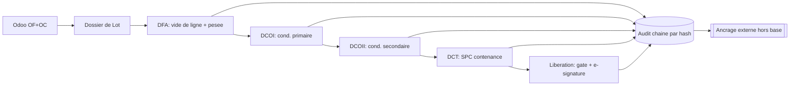

# BatchTwin — *le dossier de lot vivant*

**Paperless GMP electronic Batch Record (eBR) for Laboratoires Medicka, built on Odoo.**

> Odoo says what *should* happen. BatchTwin captures what *actually* happens — every
> gram lost, every check, every signature — and produces a compliant, costed batch
> record automatically.

**Team** — Oussama Labidi (leader) · Salem Amara · Ahmed Hammami
**Client** — Laboratoires Medicka, Nabeul, Tunisia. GMP-certified since 2010, ~100 staff,
309 products (67 % oral liquids, 23 % capsules, 7 % coated tablets, 3 % gels/creams).

---

## The problem

Medicka runs manufacturing on Odoo, but the **Dossier de Lot** — the legal record that
decides whether a lot can be sold — is on paper. Four Word documents follow every batch
around the plant:

| Code | Document | Signed by |
|---|---|---|
| **DFA** | Dossier de Fabrication | R. PROD |
| **DCOI** | Conditionnement Primaire | R. PROD |
| **DCOII** | Conditionnement Secondaire | R. PROD |
| **DCT** | Dossier de Contrôle | R. CQ |

The consequences the client lives with: costing is fiction (Odoo knows the theoretical
BOM, never the real weighing or the losses), quality is retrospective (drift is found at
the end of the shift, after the product is made), release is slow, and the record itself
is fragile — paper can be lost, back-dated, or filled in afterwards with nothing to
detect it.

## What BatchTwin is

A live digital twin of the batch record. The dossier is not a document you file at the
end — it is the thing you *work in*, and it computes as you fill it.

```
Fabrication → Cond. Primaire → Cond. Secondaire → Qualité → Libération
  R. PROD        R. PROD           R. PROD         R. CQ      PRT
   (DFA)          (DCOI)           (DCOII)         (DCT)
```

Release is refused unless every prior stage is signed, all fill checks passed, every
packaging article balances, no formula change is awaiting QA, and no deviation is open.

---

## Quick start

```bash
pip install fastapi uvicorn reportlab segno pillow httpx
python -m uvicorn backend.main:app --reload --port 8000
```

Open <http://127.0.0.1:8000>. The demo seeds itself on first load.

**Demo accounts** (a real deployment seeds these from the customer directory):

| Username | Password | Role |
|---|---|---|
| `prod.karim` | `Fabrication#26` | R. PROD — Responsable Production |
| `cq.sana` | `Controle#26` | R. CQ — Responsable Contrôle Qualité |
| `smq.leila` | `Qualite#26` | SMQ — Assurance Qualité |
| `prt.mona` | `Pharma#26` | PRT — Pharmacien Responsable Technique |

For the AI copilot (optional — the app reports it offline if absent):

```bash
ollama serve && ollama pull llama3.2 && ollama pull nomic-embed-text
```

### Tests

```bash
python -m pytest tests/ -q          # 77 passed, 8 skipped
```

The 8 skips are the live-Odoo contract tests; see *Odoo* below for how to run them.

---

## Compliance model

### Electronic signatures — 21 CFR Part 11.200

Identity comes from a **login**, never a dropdown. §11.200(a) requires two distinct
identification components, and §11.200(a)(1)(ii) requires at least one of them at *every*
signing in a session — so **the password is re-entered for each signature**, and the
signature is refused if the claimed role does not match the account.

Passwords are PBKDF2-HMAC-SHA256, 240 000 rounds, per-user salt (NIST SP 800-132),
compared in constant time. Five failures lock the account for fifteen minutes.

A signature binds **user + role + meaning + record hash + timestamp**. The record hash
covers the stage content, so a signature attests to exactly what was on screen — including
any approved formula change.

### Tamper evidence — two independent checks

1. **Internal.** The audit trail is append-only and SHA-256 hash-chained; recomputing the
   chain catches any edited or deleted row.
2. **External.** A hash chain alone proves nothing against an attacker who can write the
   database: they recompute every link and the forgery is perfectly self-consistent. So the
   chain head is also appended to `backend/audit_anchor.log` — outside the DB, itself
   chained so removing a middle line is detectable. Verification compares the two.

   `tests/test_compliance.py::test_a_full_rewrite_still_fails_against_the_external_anchor`
   performs exactly that attack and asserts the internal check passes while the anchor
   rejects it.

   In production the anchor belongs on write-once storage, mirrored to object-lock storage,
   or emailed to QA nightly. The generated PDF also prints the chain head, so an archived
   batch record is a third independent witness.

### Deviations and CAPA

A failed fill check or a failed line clearance **opens a deviation automatically** — it is
not something an operator can forget to raise. Only SMQ or PRT can close one, closing is
itself password-signed, and a root cause **and** a CAPA are both mandatory. Disposition is
*accept as is*, *rework*, or *reject*; a rejection rejects the lot. Release is blocked
while any deviation is open.

### Formula change control

Materials are editable, but as a deviation workflow, because a formula is a registered
document.

| Role | Authority |
|---|---|
| **R. PROD** | Amend a quantity **≤ ±5 %** → applies at once (in-range adjustment). Larger, or any add/remove → **pending QA** |
| **SMQ / PRT** | Hold QA authority; approve or reject R. PROD's requests |
| **R. CQ** | **Refused** — Control checks the product, it never reformulates it |

A reason is mandatory, self-approval is refused (separation of duties), materials come only
from the QA-approved Odoo catalog, and the record locks once fabrication is signed.

### Offline behaviour — a deliberate boundary

Shop-floor tablets lose Wi-Fi. **Data capture queues locally and replays** with the
operator's real timestamp preserved (ALCOA+ *Contemporaneous*), de-duplicated by a
client-generated op id so a flaky connection cannot double-count a weighing.

**Signing is deliberately excluded.** Verifying a password offline would mean caching
credentials on a shared device, and a signature that cannot check identity is not a
signature. `store.OFFLINE_KINDS` enumerates what may be deferred; the sync endpoint
rejects anything else.

### Concurrency

SQLite in WAL mode with a 30 s busy timeout, and every audited mutation runs under
`BEGIN IMMEDIATE` so two operators cannot read-then-write the same state. Anchoring is
serialised and monotonic. Tested with real threads: parallel writers, parallel audit
appends, and four simultaneous signature attempts — of which exactly one wins.

---

## Product catalog — every dossier belongs to a product

A batch record only means something against a specific product specification, so
the product is the entry point: you pick one (or create it) before any dossier
exists, and the lot list is scoped to it.

**Versioned, append-only.** In GMP a specification is a controlled document. When
the formula or packaging changes you do not edit it — you issue a new version,
and the old one stays exactly as it was, because lots already made against it
must remain readable forever.

```
code    = PF201          <- stable identity
version = 1, 2, 3 ...    <- immutable specifications
status  = draft | active | superseded
```

- Exactly one version per code is `active`; a batch stores the `product_id` of
  the precise version it was made against.
- A new version **requires a reason**, and nutrients carry forward unless replaced.
- Changing a specification field (name, strength, packaging, fill target, shelf
  life…) forces a version. Fixing a storage note or an SKU does not —
  `EDITABLE_IN_PLACE` draws that line explicitly.
- A superseded version **cannot start a new batch**.

**One template, every product.** Medicka's Word templates have the product
printed into them — `Nom du produit | Probio D3 Green Castel ®` — which is
exactly why a new product means a new document today. BatchTwin overlays the
selected specification onto the identification block of all four dossiers, marks
those cells as spec-driven, and makes them read-only: you change them by
versioning the product, not by typing. 7 fields per dossier, on DFA, DCOI, DCOII
and DCT alike.

Batch parameters follow the same rule — fill target, tolerance, unit and shelf
life come from the specification rather than from whatever the manufacturing
order happened to carry. Lot numbers are `PF954-260718-001`, unique per product
per day.

### Composition capture — optional, three ways

Nutrition data is never required. When you do want it:

| Route | How |
|---|---|
| **Manual** | Add rows: nutrient, amount, unit, basis (per unit / per dose / per 100 g / per 100 mL), % NRV |
| **Barcode / QR** | Decoded in the browser via `BarcodeDetector`, then resolved **against your own catalog** — scanning your own product finds it and offers to version it |
| **Label photo** | OCR'd by a local Ollama vision model; the image never leaves the machine |

Two deliberate choices:

- **No third-party lookup.** A manufacturer's product data has no business being
  sent to an external service, and the real use case — re-finding your own
  product — needs no such call.
- **Nothing scanned is ever saved directly.** Extracted values land in the form
  marked as scanned, for review and correction first. An OCR guess is not a
  specification.

Image size is handled adaptively: a vision model turns pixels into tokens, and a
620×760 label already costs ~18k against a 2B model's 16k window (`num_ctx` does
not raise it). The encoder steps down through a resolution ladder until the
server accepts the image, so a capable model keeps the detail and a small one
still works.

> **Honest limit:** on a machine with only a small vision model installed
> (`granite3.2-vision:2b`), label OCR is slow and frequently returns nothing
> usable. The UI says so, names the model, and points at
> `ollama pull llama3.2-vision`. Manual entry is the primary path and always works.

## Digitalised dossiers

`backend/docx_forms.py` reads Medicka's own `.docx` files, keeps the table structure, and
classifies every cell as printed label or typed input. Nothing is hand-transcribed —
change the Word file and the form changes with it.

| Dossier | Sections | Fields | Tap-choices |
|---|---|---|---|
| DFA — Fabrication | 12 | 110 | 3 |
| DCOI — Cond. Primaire | 9 | 217 | 13 |
| DCOII — Cond. Secondaire | 17 | 218 | 6 |
| DCT — Contrôle Qualité | 9 | 660 | 113 |

Field types come from the pen-guides Word uses: `___ / ___ / ____` → date picker,
`… : …` → time picker, `..........` → text.

Two transformations matter:

- **Conformity marks are two cells, not one.** On paper `S` and `NS` are separate boxes you
  ring with a pen; rendered naively they become two dead text boxes. Adjacent `S|NS`,
  `C|NC`, `O|N` pairs merge into one control — **135 checks** across the four dossiers.
  A `C/NC` column header does the same for its whole column.
- **Paper pre-prints blank grids because paper cannot grow.** DCOI carries a 92-row IPC
  log, DCT a 95-row compression table. Any run of ≥3 identical blank rows collapses to one
  template row plus *"＋ Ajouter une ligne"* — **570 blank paper lines eliminated**.

Every field saves on change and is individually audited. A correction keeps the previous
value visible (`form.correct` carries `was:`) — never a silent overwrite. Once a stage is
signed, its dossier returns 403.

---

## What else it does

**Live mass balance and true cost.** Real consumption including losses versus the Odoo BOM,
per line and per lot: true material cost per unit, loss cost (the money that never reaches
Odoo), yield, and the gap versus theoretical. Enterprise eBR systems *record* the batch;
this one *prices* it as it happens.

**Predictive SPC.** X̄/R control chart on the fill-volume check with Western Electric rules
and a linear drift forecast that warns before the specification is breached. Control limits
use the standard ASTM STP-15D / ISO 7870-2 constants, validated against a worked example in
`tests/test_compliance.py::SPCValidationTests`. Presented as indicative, not a release
criterion.

**Packaging article reconciliation.** DCOI and DCOII each carry their own balance:
issued = used + returned + waste. Any variance above 1 % blocks release, and an untouched
line reports *incomplete* rather than a false 100 % discrepancy.

**Equipment digital twin.** Real machines and protocols — GEA ECOMAX 500 L (OPC UA), GEA
Ariete NS3006 (Modbus TCP), Marchesini ML630 (Siemens S7/PROFINET), HERMA 400 (EtherNet/IP),
IMA Zanasi 40E, MG2 G140 — with live telemetry and calibration countdowns driving
OK / ALERTE / ALARME.

**Energy and carbon per lot.** kWh metered per stage, converted at 0.40 kg CO₂/kWh into
kWh and gCO₂ **per unit produced** — a product-passport line framed for the EU Digital
Product Passport.

**AI copilot.** Local Ollama (`llama3.2` + `nomic-embed-text` for real RAG over an SOP
corpus, cited sources, NDJSON streaming), grounded on live batch facts, trilingual. It is
**advisory only and structurally cannot write**: a test asserts `assistant.py` contains no
INSERT/UPDATE/DELETE and no reference to any mutating store function.

**VÉRA.** A second surface (`/vera`) for raw materials: seasonal-trend forecasting
(trend × weekday × month × Ramadan), FEFO with shelf-life projection, reorder point with
safety stock (z = 1.65), expiry write-off optimisation.

**Batch record PDF.** Print-faithful Dossier de Lot: identification, KPI strip, line
clearance, weighing with supplier/RM lot/expiry, change control, both packaging dossiers
with their article balances, SPC with drift warning, deviations and CAPA, five signature
blocks, equipment, energy passport, and an integrity section carrying the chain head and
the external-witness verdict.

---

## Architecture

```
Odoo (MRP / BOM / products)          ← real execute_kw XML-RPC contract
        │
   odoo_adapter.py   MockOdoo ⇄ LiveOdoo  (drop-in swap)
        │
   products.py       versioned product catalog + dossier adaptation
   label_scan.py     local vision OCR for nutrition labels
   auth.py           identity, PBKDF2, sessions, Part 11 re-signing
   anchor.py         external append-only witness for the audit chain
   store.py          SQLite · GMP lifecycle · deviations · change control
   analytics.py      mass balance · KPIs · SPC · energy
   docx_forms.py     .docx → fillable form spec
   equipment.py      machine twin + industrial protocols
   inventory.py      VÉRA forecasting engine
   assistant.py      Ollama RAG copilot (read-only)
   report.py         ReportLab PDF
        │
   main.py           FastAPI · 73 routes
        │
   frontend/         vanilla HTML/CSS/JS · React+Recharts (vendored) for /vera
```



**Why SQLite.** One file, zero setup, transactional. The demo just runs, and it is still a
real relational store — WAL and immediate transactions make it safe for the concurrency a
single production line actually generates.

### Odoo

`odoo_adapter.py` mirrors Odoo's real external API — `execute_kw(model, method, args,
kwargs)` over XML-RPC — against the standard models (`mrp.production`, `mrp.bom`,
`mrp.bom.line`, `product.product`, `stock.lot`, `quality.point`). Going live means
instantiating `LiveOdoo` instead of `MockOdoo`; nothing else changes.

That claim is testable rather than asserted. `tests/test_odoo_contract.py` is one suite of
expectations that **any** adapter must satisfy. It runs against the mock always, and
against a real instance when the environment provides one:

```bash
ODOO_URL=https://erp.example.com ODOO_DB=medicka \
ODOO_USER=admin ODOO_PASSWORD=... python -m pytest tests/test_odoo_contract.py -v
```

Without those variables the live cases are reported as **skipped**, never quietly passed.
For a quick read-only check against a real server:

```bash
python -m backend.odoo_adapter --url https://erp.example.com --db medicka \
    --user admin --password ***
```

### Products modelled

| Code | Product | Batch | Fill |
|---|---|---|---|
| `FG-MGB6-200` | Sirop Magnésium + Vitamine B6 200 mL | 800 units | 200 mL ± 8 |
| `FG-SPIR-60` | Gélules Spiruline 500 mg — pilulier 60 | 100 piluliers | 500 mg ± 25 |

---

## Interface

- Premium dark SaaS skin (`#05070B`, `#6C63FF → #A855F7 → #38BDF8`, Inter, glassmorphism)
  **and a working light theme** — every surface uses `--fill` / `--hi` / `--panel` tokens
  rather than hardcoded whites; the choice persists in `localStorage`.
- Tablet-first: 44–46 px touch targets, rich dropdowns backed by hidden native `<select>`s,
  visible navigation with no hidden overflow menu.
- Trilingual **EN / FR / AR** with full RTL, 492 dictionary keys, vendored Inter and Noto
  Arabic (no external font requests).
- Installable PWA — manifest, service worker, maskable icons.
- The theme toggle is on `/app`; `/floor` (shop-floor tablet) and `/vera` (its own visual
  identity) are single-theme by design.

---

## Demo script (3 minutes)

1. Sign in as `prod.karim`. Nothing renders before identity is established.
2. Click the **product chip** in the header: the catalog opens. Pick *Calcimax* —
   it has no batch yet, so the app offers to open one, and every dossier now
   reads Calcimax instead of the template's hardcoded product.
3. **Documents** tab — the four real dossiers, parsed from Word, ready to fill on a tablet.
4. **Production** — *⚡ Simuler pesée*: the tiles show real-vs-theoretical cost and the loss
   in €. Try editing a material: ≤ ±5 % applies, more goes to QA.
5. **Quality** — *+ avec dérive* a few times: the SPC chart turns red and forecasts the
   breach. A failure **opens a deviation by itself**.
6. Sign Fabrication — a **password is demanded**. Enter it, watch the stage lock.
7. Try Libération: refused, and the message names precisely what is blocking.
8. Sign in as `smq.leila`, close the deviation with a root cause and a CAPA (signed again).
9. **⬇ Dossier de Lot (PDF)** — the paper binder, generated from the same records.
10. Falsify a row in the database directly: the integrity badge turns red. Recompute the
   whole chain to hide it — **the external anchor still catches it**.

---

## Honest limits

Stated here rather than left for someone else to find:

- **No live Odoo instance ships with this repo.** The contract suite makes the adapter
  claim falsifiable, but a screenshot of a real Odoo responding would settle it outright.
- **Offline signing is not supported**, by choice — see *Offline behaviour* above.
- **The SPC drift forecast is a linear fit** over subgroup means. Standard and defensible;
  treat it as indicative, not as a release criterion.
- **The AI is not validated for GMP use.** That is exactly why it is advisory-only and
  structurally incapable of writing.
- **Concurrency is tested at the scale of one line.** Forty simultaneous lots is untested.
- **Not a validated system.** IQ/OQ/PQ, supplier qualification and periodic review are
  deployment activities, not code.

---

## Repository layout

```
backend/     API, GMP store, auth, anchor, analytics, docx parsing, PDF, adapters
frontend/    dashboard, landing, VÉRA, floor mode, projections, i18n, PWA assets
dossier/     the four real Medicka .docx dossiers (parsed at runtime)
logo/        source logo lockups
docs/        idea-document generators and their output
tests/       pytest suite — compliance evidence, Odoo contract, docx parsing
```

---

*Where a number appears in this document it was computed by the code in this repository,
not estimated.*
