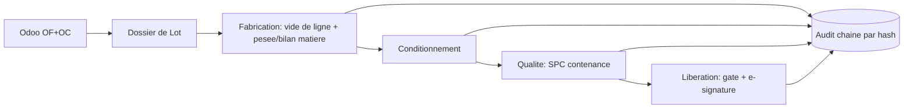

# BatchTwin — *le dossier de lot vivant*

**Client:** Medickalab (compléments alimentaires, bouteilles) · **ERP:** Odoo (MTO)

> **Odoo dit ce qui *devrait* se passer. BatchTwin capture ce qui *se passe vraiment* —
> chaque gramme perdu, chaque minute travaillée, chaque contrôle — et produit un
> dossier de lot papier-zéro, conforme, avec le coût et le rendement réels, automatiquement.**

## Le problème
Chez Medickalab, tout le **Dossier de Lot** est sur papier : Fabrication →
Conditionnement → Qualité → Libération. Conséquences : la **perte matière à la pesée**
(poussière/goutte) est invisible, le **contrôle contenance** (10 flacons / 30 min) dort
dans des classeurs, et personne ne connaît le **coût ni le rendement réels** d'un lot.

## Les 3 piliers
1. **Dossier de Lot papier-zéro & conforme** — signatures électroniques par rôle,
   libération *bloquée* tant que les 4 étapes ne sont pas signées et la qualité PASS.
   Piste d'audit **chaînée par hash (inviolable)** → ALCOA+ / 21 CFR Part 11.
2. **Bilan matière en direct** — consommation réelle (pertes incluses) vs. nomenclature
   Odoo → **coût vrai par unité** + la perte matière comme KPI récupéré.
3. **SPC prédictif sur la contenance** — carte X̄/R + règles Western Electric +
   **prévision de dérive** : « sous-remplissage dans ~22 min, ajustez la remplisseuse
   maintenant » — avant de fabriquer du rebut.

## Pourquoi ça gagne
Les MES d'entreprise (Tulip, MasterControl, Körber) sont chers et **pas natifs Odoo** —
or Odoo est ce que tournent les PME du secteur. Un eBR **natif Odoo** avec bilan matière,
SPC prédictif et coût réel temps-réel est la case blanche du marché. Chaque coefficient
est traçable ; rien n'est inventé.

## Lancer
```bash
cd BatchTwin
python -m uvicorn backend.main:app --reload --port 8000
# ouvrir http://localhost:8000
```

## Script de démo (3 min)
1. **Nouveau lot** — le Dossier de Lot est créé depuis l'OF + OC (mock Odoo).
2. Cocher le **vide de ligne** ; décocher un item → escalade automatique au responsable.
3. **⚡ Simuler pesée** — les tuiles montrent l'écart coût réel/théorique et la perte €.
4. **+ avec dérive** ×6–8 — la carte SPC vire au rouge, la **prévision** s'affiche.
5. Changer d'utilisateur (menu haut-droite) et **signer** Fabrication/Conditionnement/Qualité.
6. Tenter la **Libération** avec le mauvais rôle → refusée. En QA → libérée.
7. **⬇ Dossier de Lot (PDF)** → un dossier de lot complet, signé et horodaté, se télécharge
   en un clic : c'est le classeur papier remplacé, généré depuis les mêmes enregistrements.
8. **🔨 Falsifier un enregistrement** → le badge d'intégrité passe au rouge instantanément.

## Passer en Odoo réel
`backend/odoo_adapter.py` : remplacer `MockOdoo()` par
`LiveOdoo(url, db, user, password)`. Le reste du code est déjà écrit pour l'API
XML-RPC réelle d'Odoo — rien d'autre à changer.

## Architecture
```
backend/
  odoo_adapter.py  MockOdoo / LiveOdoo — contrat XML-RPC Odoo réel
  store.py         SQLite + cycle de vie du dossier + audit chaîné par hash + signatures
  analytics.py     bilan matière (coût vrai) + SPC (X̄/R, Western Electric, prévision)
  main.py          API FastAPI + sert le frontend
frontend/
  index.html       cockpit (thème clair/sombre)
  app.js           rendu + carte de contrôle SVG
```

