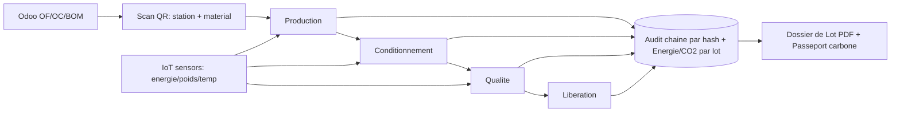

# BatchTwin — The Living Batch Record
### Pharma-grade traceability, real cost, and carbon intelligence for SME supplement & pharma makers — natively on Odoo

*Sector 3 · Industry   |   Design partner: Medicka Laboratories   |   Team leader: Oussama Labidi   ·   Members: Salem Amara, Ahmed Hammami*

> **Odoo tells you what should happen. BatchTwin captures what actually happens — and closes the gap in cost, quality, compliance, and carbon, automatically.**

> **⚠ Snapshot — superseded.** This document describes BatchTwin as submitted at
> the idea stage. The software has moved on substantially since: authentication
> and Part 11 re-signing, the DCOI/DCOII split into five lifecycle stages, a
> versioned product catalog, deviations and CAPA, configurable industry
> profiles, the parallel-run migration path, and telemetry separation are all
> absent here. For what the software contains today see
> [WHAT_IS_BUILT.md](WHAT_IS_BUILT.md); for the commercial model see
> [BUSINESS_MODEL.md](BUSINESS_MODEL.md). Kept as the record of what was
> originally proposed.

## 1. Problem statement

Makers of food supplements live and die by one document: the **batch record** (dossier de lot). It proves, batch by batch, what was made, from which raw materials, tested how, and released by whom — across four legally-required sections: **Production, Conditionnement (packaging), Qualité, and Libération (release)**. Our design partner, **Medicka Laboratories** (Nabeul, Tunisia — GMP-certified since 2010, ~100 staff, 309 products, two-thirds of them oral liquids), still keeps that entire record on **paper**.

Paper batch records are slow, error-prone, and blind:

- **Quality already costs manufacturers ~15% of revenue** (cost of poor quality). One missing signature, illegible weight, or transcription slip can put a whole batch on hold.
- **Release is slow.** QA reviews every page by hand; a batch can wait days to be released and sold.
- **Material loss is invisible.** At weighing (pesée), raw material is lost to dust and spillage — “some goes to the air, some drops.” The ERP deducts only the *theoretical* recipe quantity, so the loss never appears; it silently inflates cost and corrupts stock.
- **In-process quality data is thrown away.** Every 30 min an operator measures the fill of 10 bottles and writes it on paper — data that could predict an underfill *before* it happens, dying in a binder.
- **Energy and carbon per product are unknown.** No SME supplement maker can today state the kWh or CO2 behind one bottle.

Concrete example — a batch of 800 bottles of a magnesium + vitamin-B6 oral syrup (200 mL): QA cannot confirm the fill-volume checks stayed in tolerance without leafing through pages; the euros of syrup lost at dispensing never show up; and if a fill sample drifts low at 3 pm, nobody sees the trend until bottles are already underfilled and scrapped.

## 2. Our solution

**BatchTwin is the living batch record** — a digital layer on top of the factory's existing **Odoo** ERP that runs the batch as it actually happens (every gram, every check, every signature, every kilowatt-hour) and produces a paperless, compliant, one-click batch record.

On the floor:

- Every order, workstation, raw-material container, and machine carries a **QR / barcode**. The operator **scans to act** — scan the station, scan the material, confirm the weight. No typing, no wrong-material mistakes.
- **Device-agnostic and interruption-free.** Have a phone? Use the app. No phone, or phones kept off the floor? Use a **shared company tablet** at the station and scan the same codes. Nobody depends on a personal device, and no task is lost when someone steps out or leaves the company.
- **Role-by-sector, not role-per-person.** Access follows the four sectors; one person can hold several roles. The system shows each user only the tasks they may sign — and blocks the ones they may not.
- Every action is written to a **tamper-evident, hash-chained audit trail** and sealed with an **electronic signature**. Release is **gated**: no libération until all four sections are signed and every quality check passed.
- One click produces the **PDF batch record** — the paper binder, replaced.

**Value proposition:** pharma-grade traceability, real-time true cost, predictive quality, and per-batch carbon — at SME cost, without ripping out Odoo.

## 3. Innovation — what's different

Not “scan the paper into a PDF.” A unique combination:

- **Odoo-native electronic Batch Record (eBR).** Enterprise MES/eBR are not built on Odoo — the ERP SMEs actually run. We extend Odoo, not replace it.
- **Live mass-balance loss reconciliation.** We capture the *real* consumed quantity (losses included) at each step and reconcile it against the theoretical bill of materials → **true cost per unit**, and invisible waste becomes a tracked KPI. Even large MES rarely close this loop.
- **Predictive SPC on in-process checks.** The 10-bottle fill sampling becomes a live control chart with Western Electric rules and a **drift forecast**: “trend toward underfill — spec breach in ~22 min — adjust the filler now,” before scrap is made.
- **Data integrity by construction.** A SHA-256 hash-chained audit trail makes every record tamper-evident — aligned with **ALCOA+ / FDA 21 CFR Part 11 / EU GMP Annex 11**. Alter one record and the chain visibly breaks.
- **Energy & carbon per batch, per dossier.** Low-cost IoT sensors (energy clamps, scales, temperature/vibration) meter each workstation; energy used during a batch is allocated to it and split across the four dossiers → **kWh and CO2 per unit**, a first for an SME supplement line.
- **Scan-to-act, device-agnostic execution.** Consumer-grade QR/barcode scanning on any phone or shared tablet brings zero-friction, error-proof capture to the floor.

## 4. Quantified impact

Industry benchmarks: cost of poor quality ~**15% of revenue**; electronic batch records cut record-review effort **50–90%** (review-by-exception) and compress release from **days to hours**; AI-assisted monitoring cuts errors **20–50%**.

Estimated impact for a typical SME line (~10 batches/week — assumptions below):

| Lever | Before (paper) | With BatchTwin | Gain |
|---|---|---|---|
| QA batch-record review | ~3 h / batch | ~30 min / batch | −~25 h / week |
| Operator documentation | ~45 min / batch | ~15 min / batch | −~5 h / week |
| Documentation-error rework | frequent, manual | forced fields + e-sign | ~90% fewer |
| Batch release lead time | days | hours | faster cash + capacity |
| Material loss at dispensing | invisible | measured | *(euro value unknown until measured — Odoo cannot produce it)* |
| Fill give-away | ~1–2% overfill | tightened via SPC | ~1% fill material saved |
| Energy per batch | unknown | metered & targeted | 10–15% reduction opportunity |

**Net:** on the order of **30 skilled hours saved per week**, **near-100% right-first-time** documentation, **release in hours not days**, direct **COGS + energy savings**, and a compliance-and-carbon record that did not exist before.

_Assumptions: ~10 batches/week; material cost ~€8k/batch; regional QA labour cost. Planning estimates, to be validated on Medickalab data._

## 5. Feasibility — the 48/72h plan

We are not starting from zero: a **working prototype already exists** — batch lifecycle, e-signatures, hash-chained audit trail, live mass-balance, predictive SPC, and a one-click PDF batch record, with an Odoo integration layer written to Odoo's real XML-RPC API contract. The hard core is proven, which de-risks the build.

- **0–12h — Odoo & data:** connect a real Odoo Community instance; finalize the batch / BOM / quality mapping.
- **12–30h — Execution app:** mobile/tablet PWA with QR/barcode scan; role-by-sector task screens for the four dossiers; offline-tolerant capture.
- **30–48h — IoT & carbon:** wire one live sensor (ESP32 + energy clamp / USB scale, or a phone sensor) to a workstation; allocate energy to the batch; compute kWh and CO2 per unit and per dossier.
- **48–72h — Polish & pitch:** cost / yield / energy / CO2 dashboards, UI refinement, PDF, and a scripted end-to-end demo.

**Resources:** 1 laptop, free **Odoo Community**, an **ESP32 + clamp meter or USB scale (~€20–40)** or phone sensors, and an open-source stack (Python/FastAPI, SQLite/Postgres, a PWA front-end). Total hardware under €50.

## 6. Originality — why it's memorable

- **Pharma-grade compliance on a supplement-SME budget.** We repurpose consumer tech — a phone camera for QR, a ~€5 microcontroller + clamp meter for energy, a USB scale for mass balance — to deliver 21 CFR Part 11-style integrity that normally costs six figures.
- **The batch record becomes a sustainability passport.** By attaching energy and CO2 to each batch and dossier, BatchTwin already produces the provenance-and-carbon data the **EU Digital Product Passport** (under the Ecodesign for Sustainable Products Regulation) will soon require — turning a compliance chore into a future-proof asset.
- **Nobody is left out.** Scan-to-act, bring-your-own-device-or-use-ours: an operator with no phone is as fast as one with a phone, and no task is interrupted when someone leaves the floor.

## 7. Target audience & use cases

Primary: **SME food-supplement and small-batch pharma / cosmetics manufacturers** running Odoo (or similar). **Medickalab** is our design partner.

- **Operators & packaging agents** — on the line, scanning stations and materials, confirming weights and fill checks (every batch, every shift).
- **QC technicians** — recording in-process checks, watching the SPC chart, catching drift.
- **QA / release managers** — reviewing by exception and releasing batches from the office.
- **Plant managers / owners** — watching cost, yield, energy and CO2 dashboards.

Frequency: continuous — one living record per batch, used at every step, every day.

## 8. Competitive differentiation

- **Paper + Excel (status quo):** cheap but slow, error-prone, no real-time data, no integrity, no cost/energy visibility. We keep the low cost and remove the pain.
- **Enterprise MES / eBR (Tulip, MasterControl, Körber, Werum PAS-X):** powerful but **five-to-six-figure** cost, **6–18 month** rollouts, and **not Odoo-native** — overkill for an SME. We deliver the essential 20% that gives 80% of the value, in days, on Odoo.
- **Odoo's own Quality/MRP modules:** a solid ERP backbone, but no true GMP batch record (no e-signatures, no gated release, no mass-balance loss, no predictive SPC, no energy/CO2). We **extend** Odoo — complementary, not competing.

**Our position: the missing layer between paper and enterprise MES** — Odoo-native, IoT-ready, carbon-aware, at SME cost.

## Vision — the future of the line

A factory where every batch carries a complete digital twin from raw material to release: self-documenting, self-costing, self-auditing, carbon-aware. The paper binder disappears; the operator just scans and works; QA releases by exception; and the owner sees, for the first time, the true cost and the true footprint of every bottle — built on the ERP the factory already owns.

## Architecture at a glance

