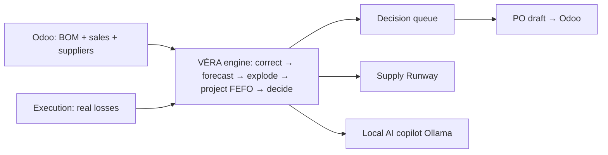

# VÉRA — The Self-Correcting Inventory Brain
### AI-driven raw-material forecasting & replenishment for SME food-supplement makers — that fixes the data before it forecasts.

*Sector: Industry · Inventory & Supply Chain   |   Design partner: Medicka Laboratories (Nabeul, Tunisia)   |   Team leader: Oussama Labidi   ·   Members: Salem Amara, Ahmed Hammami*

> **Most inventory AI forecasts demand on numbers that are already wrong. VÉRA corrects reality first — real consumption, not theoretical recipes — then forecasts, sees expiry, and turns stock into a ranked decision queue.**

> **⚠ Snapshot — superseded.** This document describes BatchTwin as submitted at
> the idea stage. The software has moved on substantially since: authentication
> and Part 11 re-signing, the DCOI/DCOII split into five lifecycle stages, a
> versioned product catalog, deviations and CAPA, configurable industry
> profiles, the parallel-run migration path, and telemetry separation are all
> absent here. For what the software contains today see
> [WHAT_IS_BUILT.md](WHAT_IS_BUILT.md); for the commercial model see
> [BUSINESS_MODEL.md](BUSINESS_MODEL.md). Kept as the record of what was
> originally proposed.

## 1. Problem statement

For a manufacturer, inventory is where cash goes to hide. It typically ties up **20–30% of working capital**, and holding it costs another **20–30% of its value per year** (storage, financing, insurance, obsolescence). Get it wrong in either direction and you lose: too little → **stockouts** that halt production and lose sales (AI-grade forecasting can recover **up to 65% of lost sales**, per this challenge's own brief); too much → frozen cash and, for perishables, **expiry write-offs** — stock destroyed unsold.

Our design partner, **Medicka Laboratories** (Nabeul, Tunisia — GMP-certified since 2010, ~100 staff, **309 products**, two-thirds of them oral liquids), plans raw materials in Odoo. Two structural problems bite every SME like it:

- **The ERP plans on fiction.** It deducts *theoretical* recipe (BOM) quantities and ignores real process losses (powder to the air, liquid dripping). So its stock and requirement numbers are **systematically too low** — a quiet bias that causes surprise stockouts on exactly the materials that lose the most.
- **Perishability is unmodelled.** Vitamins, plant extracts and flavours degrade. Classic min/max reordering has no concept of shelf life, so it happily lets you over-order something that then expires.
- **Long, variable import lead times.** Active ingredients ship from Europe/Asia with **45–50 day** lead times — if a stockout is spotted late, it cannot be fixed in time.

Concrete, from the live model: **Poudre de spiruline** has only **38 days of cover** against a **50-day** supplier lead time — it *will* run out before any new order can arrive. Meanwhile **138 kg of orange flavour (€3,040)** sits over-stocked and will **expire in 57 days**, entirely invisible in the ERP. Neither is on anyone's radar today.

## 2. Our solution

**VÉRA (Veritas Engine for Replenishment & Anticipation)** is a self-correcting inventory brain that sits on top of the existing **Odoo** ERP. It runs a five-step loop, every day, per material:

- **Correct reality** — real requirement = theoretical BOM × (1 + measured loss), learned from production execution. The numbers are fixed *before* anything else.
- **Forecast demand** — finished-good demand via seasonal-trend decomposition (trend × weekday × month × **Ramadan**, a real local signal), with an uncertainty band.
- **Explode true requirements** — forecast demand pushed through the Odoo BOM into corrected raw-material needs.
- **Project forward (FEFO + shelf life)** — a day-by-day trajectory for each material that finds both the **stockout day** and the **expiry write-off**.
- **Decide** — a ranked queue: what to order, how much, by when, from which supplier — and what will spoil if nothing changes.

**Value proposition:** prevent stockouts *and* expiry with decisions grounded in reality, on the ERP the factory already runs, at SME cost — plus a **100%-local AI copilot** that explains every recommendation. The operator sees a **Supply Runway** (each material's future, with the stockout and expiry cliffs), a **decision queue**, and can ask *"what do I order this week and why?"* in plain language.

## 3. Innovation — what's different

- **Fix the data before forecasting.** Every competitor forecasts on the ERP's biased numbers. VÉRA measures the bias (from execution/loss data) and corrects it first — a genuinely contrarian, garbage-in-first approach.
- **Dual-risk optimisation.** It arbitrates **stockout *and* expiry write-off together** (FEFO + shelf life). Classic tools optimise one and ignore the other.
- **Local demand signals.** Seasonal-trend decomposition with a Ramadan factor — tuned to the Tunisian/regional market, not a generic global model.
- **100%-local AI copilot (Ollama).** Retrieval-augmented answers grounded in the *computed* decisions — no cloud, no data leaving the plant. A real fit for a privacy-sensitive SME.
- **Cross-domain reuse.** The loss/yield correction is *measured* from GMP batch execution, not assumed — turning quality-execution data into supply-chain intelligence.

## 4. Quantified impact

**Industry benchmarks (cited):** AI-driven forecasting cuts errors by **20–50%** and lost sales by **up to 65%** (this challenge's brief); inventory carrying cost runs **~20–30%/yr** of stock value; safety-stock optimisation typically frees **10–30%** of inventory at equal service level.

**VÉRA on the live demonstration dataset** (deterministic, realistic; 19 materials, 120-day horizon, 540 days of history — figures to be re-based on Medicka's own data):

| Lever | Without VÉRA | With VÉRA | Result |
|---|---|---|---|
| ERP requirement bias | theoretical BOM, −1.03% | corrected (+ losses) | under-ordering removed (~€573/yr) |
| Urgent stockout | found too late | flagged 40 days out (lead 50 d) | line-stop averted (expedite in time) |
| Expiry write-off | invisible | €3,040 surfaced (flavour) | avoidable dead loss caught |
| Reorder decisions | manual spreadsheet review | auto-ranked queue, 19 materials | hours/week of planning saved |
| Forecast error | naïve / manual | seasonal + Ramadan decomposition | −20–50% (benchmark) |
| Tied-up inventory | static min/max | cover + expiry optimised | −10–30% (benchmark) |

**Headline:** on this dataset VÉRA catches **1 urgent stockout 40 days early**, surfaces **€3,040** of avoidable expiry, removes a **€573/yr** silent under-ordering bias, and replaces manual reorder review with an **auto-ranked plan across 19 materials** — on **€13,861** of managed stock (of which **€3,464** is dormant).

_Assumptions: demonstration dataset built from Medicka's real BOMs plus realistic demand, lead times and loss rates; € figures are illustrative pending calibration on the client's books. Benchmarks are external and cited above._

## 5. Feasibility — the 48/72h plan

Low risk: a **working prototype already exists** — the forecasting engine, FEFO/expiry projection, reorder recommendations, KPIs, the ranked decision queue, the Supply Runway command-center UI, and the local AI copilot, all reading real Odoo BOMs. The hard core is proven.

- **0–12h — Data:** connect a real Odoo Community instance; ingest real sales history and supplier lead times; calibrate loss rates from execution records.
- **12–30h — Loop:** finalise forecast + FEFO projection on real data; tune safety-stock and expiry caps per material class (imported active vs local excipient vs packaging).
- **30–48h — Action:** one-click **purchase-order draft write-back** to Odoo (human-confirmed); alerts for urgent stockouts and expiry.
- **48–72h — Polish & pitch:** dashboards, the copilot, and a scripted end-to-end demo (line filter, runway, decision → PO).

**Resources:** one laptop; **Odoo Community** (free); **Ollama** local LLM (free); an open-source Python stack (NumPy/pandas + FastAPI) and a self-contained web UI. Marginal cost ≈ **€0** — no cloud, no licences.

## 6. Originality — why it's memorable

- **A contrarian one-liner judges remember:** "everyone forecasts demand; nobody fixes the numbers first." VÉRA does the unglamorous, high-impact thing.
- **Clever repurposing:** GMP batch-execution *loss* data — normally a quality artefact — becomes the correction signal for supply-chain planning. Two problems, one dataset.
- **Ingenious low-cost approach:** enterprise-grade replenishment intelligence with a **local** LLM and open-source stack, for an SME budget and an SME's privacy.
- **A memorable visual:** the **Supply Runway** — each material's future as a runway with a stockout cliff and an expiry cliff — makes an abstract risk instantly legible.

## 7. Target audience & use cases

Primary: **SME food-supplement, pharma and cosmetics manufacturers** running Odoo (or a similar ERP), especially those handling **perishable, imported raw materials**. Medicka Laboratories is the design partner.

- **Supply / procurement planner** — works the ranked decision queue daily: what to order, how much, by when (the core user).
- **Production & QA** — watch expiry risk and FEFO; avoid formulating with soon-to-expire lots.
- **Plant manager** — the risk overview: urgent stockouts, expiry exposure, dead stock.
- **Owner / finance** — cash tied up, waste avoided, service level.

Context & frequency: **daily** planning on the shop-floor office; per-material decisions reviewed continuously; a **line filter** scopes the view to one product family (e.g. the capsule line) when needed.

## 8. Competitive differentiation

- **Odoo's own reordering rules / MRP:** reactive min/max on *theoretical* BOM — no demand ML, no expiry logic, no loss correction. VÉRA **extends** Odoo with exactly those missing brains; complementary, not a rip-and-replace.
- **Enterprise supply-chain suites (Kinaxis, o9, Blue Yonder, SAP IBP):** powerful but **six-to-seven-figure** cost and **many-month** deployments, and not tuned for a perishable SME. VÉRA delivers the essential 20% of the value on Odoo, in days.
- **Generic forecasting tools / spreadsheets:** forecast on *uncorrected* data, model neither expiry nor replenishment, and don't close the loop to a purchase order. VÉRA fixes the data, models both risks, and drafts the order.

**Position: the missing layer between Odoo's basic rules and enterprise suites** — data-correcting, expiry-aware, local-AI, SME-priced.

## Vision

An SME supply chain that anticipates instead of reacts: every material carries a live trajectory, every order is a justified decision instead of a guess, waste and stockouts both fall, and the planner spends minutes confirming a ranked plan rather than hours rebuilding a spreadsheet — all on the ERP the factory already owns, with the AI running on its own hardware.

## Architecture at a glance

